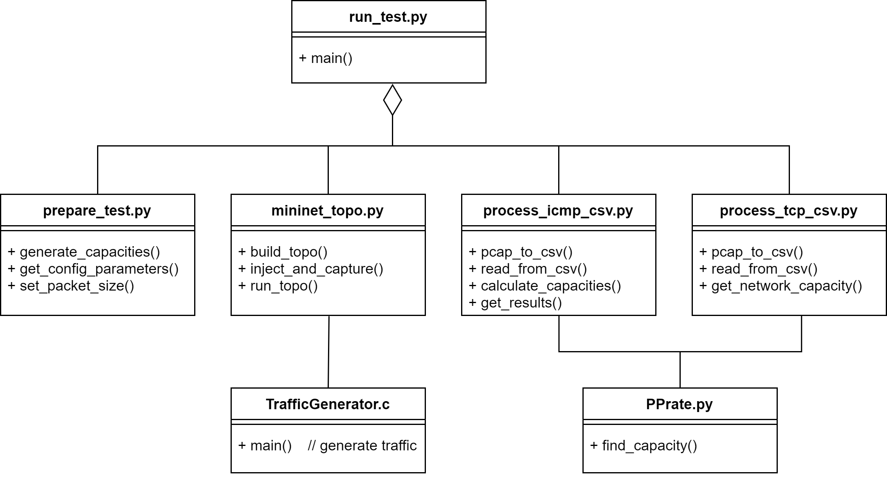

**Hop-by-Hop Capacity Estimation Framework**

_PPrate implementation and TCP algorithm belong to P. Brzoza_

**Getting Started**

Run `install.sh` file in order to install the following dependencies:
- Mininet
- numpy
- scipy
- Pandas
- tshark

as well as compile `TrafficGenerator.c` file

**Functionality**



**Usage**

The measurements must be run with a JSON config file containing all the parameters that are interesting and important for our measurements. Manipulating these parameters gives us a better picture about strengths and weaknesses of our approach.

The following script executes the experiment:

`$ sudo python run_test.py config.json`

The following JSON serves as an example of a configuration file used for experiments.
It contains default parameter values, each of which can be manipulated during test runs:
```
{
 "topo_size": 3,
 "capacity_range": [10, 100],
 "capacity_delta": 5,
 "packet_size": 1400,
 "packets_per_hop": 300,
 "icmp_ratelimit": 0,
 "packet_loss": 0,
 "cross_traffic": 0.0,
 "output": "results/results.csv"
}
```

_Disclaimer: packet_loss is a probability, therefore it does not always cause the packet loss during test runs; On the other hand, regular test runs with `packet_loss = 0` can result in lost packets._
